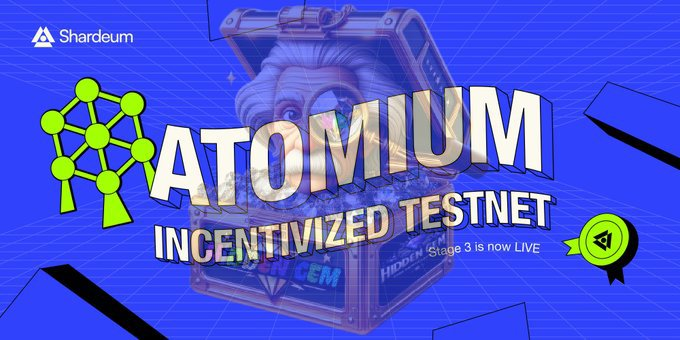
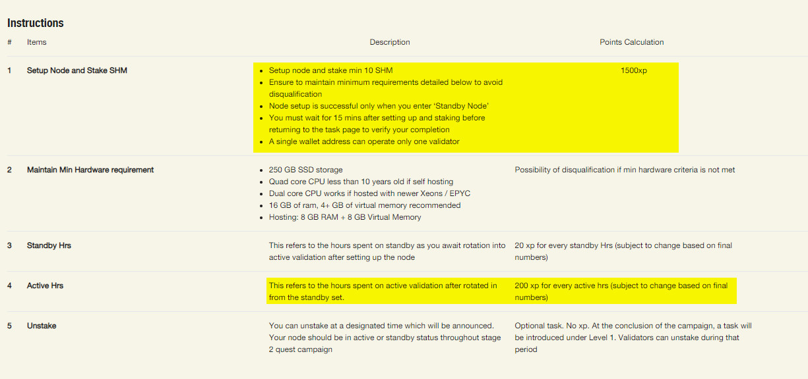
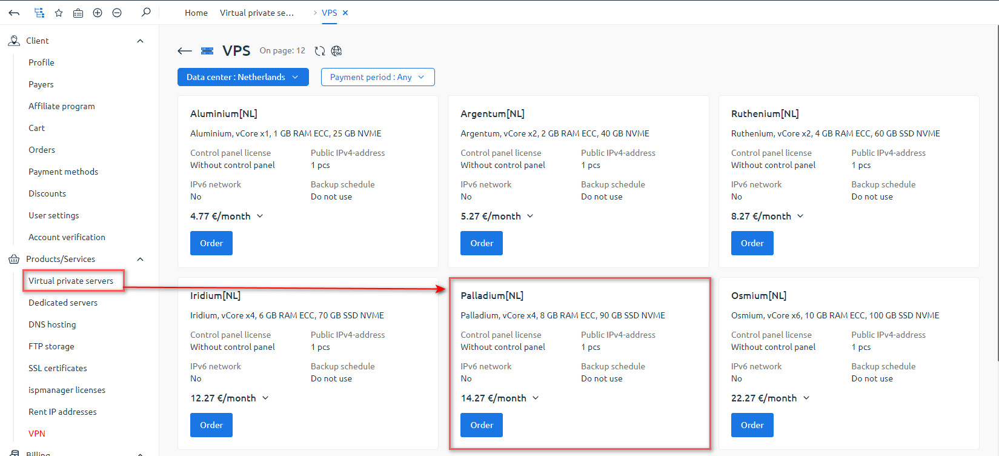
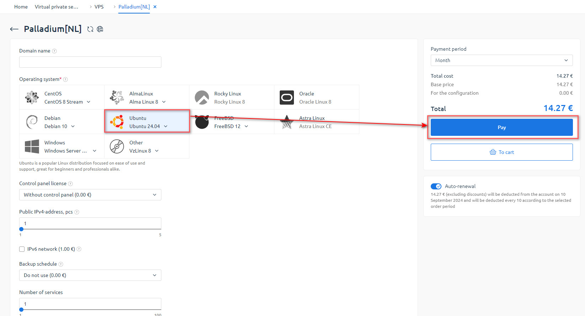
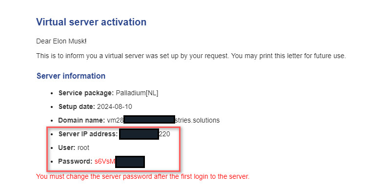
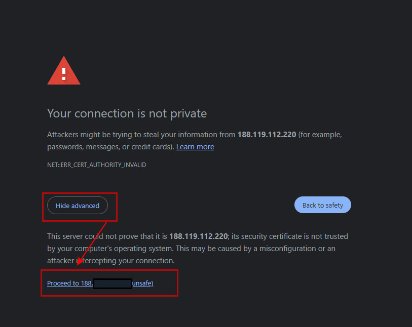
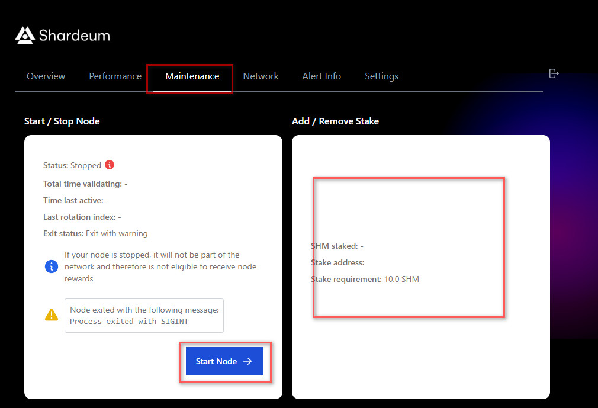
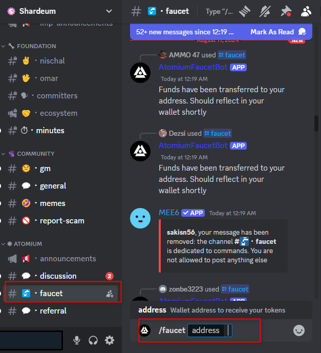
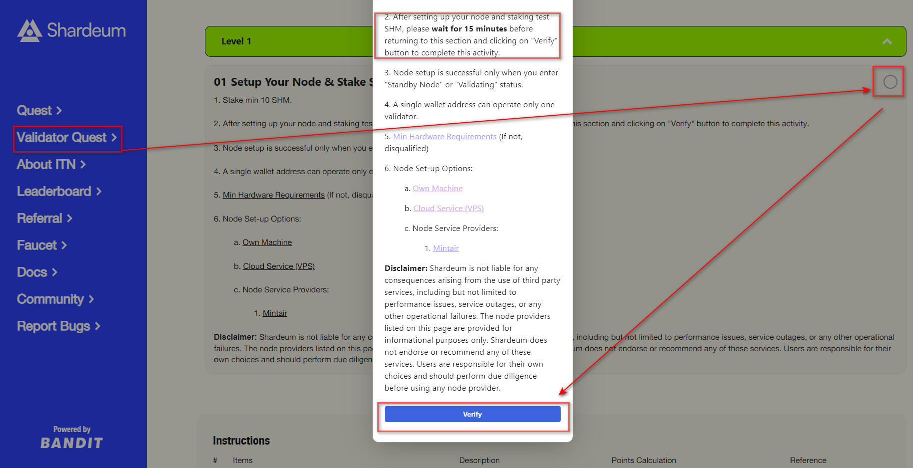

# Shardeum Testnet Stage 3 Validator Quest and Run Node

<p align="center">

</p>

<p align="center">

</p>


# System Requirements

|                |       Minimum            |       Recommended            |
|----------------|--------------------------|------------------------------|
| **RAM**        | 8 GB RAM                 | 16 GB+ RAM                   |
| **CPU Cores**  | 2 CPU cores              | 4+ CPU cores                 |
| **Disk Space** | 20 GB free disk space    | 250 GB+ free disk space (SSD) |
| **Architecture** | amd64 CPU Architecture | amd64 CPU Architecture       |
| **Operating System** | Ubuntu 22.04       | Ubuntu 22.04                 |


# Buy VPS From [PQHosting HERE](https://pq.hosting/?from=557648)

<p align="left">

</p>

<p align="left">

</p>

- You Can Pay via Crypto & Complete Payment
- Wait Few Minutes and Check Your Email
- Save Your IP, Password & Username in NotePad
- <p align="left">

</p>

# Open Termius / Putty
- Enter Your IP Address & Open
- Username- root
- Your VPS Password & Enter

# Now Install Node Copy/Past Following Command

use curl in this tutorial to download files
```
sudo apt-get install curl
```

add Homebrew to your PATH:
```
echo 'eval "$(/opt/homebrew/bin/brew shellenv)"'
eval "$(/opt/homebrew/bin/brew shellenv)"
```

Update package managers
```
sudo apt update
```

Install docker and docker.io
```
sudo apt install docker.io
```

Install docker-compose
```
sudo curl -L "https://github.com/docker/compose/releases/download/1.29.2/docker-compose-$(uname -s)-$(uname -m)" -o /usr/local/bin/docker-compose
```

Setup permissions for docker-compose:
```
sudo chmod +x /usr/local/bin/docker-compose
```

Download and Install Validator
```
curl -O https://raw.githubusercontent.com/BidyutRoy2/Shardeum-node/main/installer.sh && chmod +x installer.sh && ./installer.sh
```

- The terminal will ask questions about your setup settings
- Y , Y , Set Your Password, Set Default IP, Port Just Hit Enter
- Wait For Node Installsation Complete

# Login Your Node dashboard

VPS Users
```
https://Your VPS IP:8080
```
- Click "Advance" & Proceed To
- Enter Your Node Dashboard Password
- Go To Click "Maintence"
- Connect Wallet & Stake Min 10 SHM
- After Stake Complete Start Node

<p align="left">

</p>


<p align="left">

</p>
  

# Claim Faucet on [Discord](https://discord.gg/shardeum)

<p align="left">

</p>
  


# Verify Your Node Stage 2 Validator Quests

## Register Link [Click HERE](https://shardeum.org/incentivized-testnet?referral-code=shardeum3)

- Connect Your Wallet
- Enter Code: `shardeum3`
- Click "Validator Quest"
- Verify Your Node
- Go To "Quest" & Complete Others task
- Done

<p align="left">

</p>


# ▄︻デ𝙂𝙚𝙩 𝙇𝙖𝙩𝙚𝙨𝙩 𝘼𝙞𝙧𝙙𝙧𝙤𝙥𝙨 & 𝙐𝙥𝙙𝙖𝙩𝙚𝙨═━一

### ▄︻デ𝙅𝙤𝙞𝙣 𝙏𝙚𝙡𝙚𝙜𝙧𝙖𝙢═━一 [🎀  𝐻𝒾𝒹𝒹𝑒𝓃 𝒢𝑒𝓂  🎀](https://t.me/hiddengemnews) 

### ░▒▓█►─═  𝓗𝓲𝒹ᗪ𝓔η Ǥέ𝕄 ═─◄█▓▒░
